# AUTHORS:


### Abhimanyu Borthakur (406530322)


### Lorenzo Bolls (505997448)


### Arthur Baghdasian (006001418)


```python
import pandas as pd
import matplotlib.pyplot as plt
import numpy as np
from surprise import Reader, Dataset, accuracy
from surprise.prediction_algorithms.knns import KNNWithMeans
from surprise.model_selection import cross_validate, KFold, train_test_split
from sklearn.metrics import roc_curve, auc, mean_squared_error
from surprise.prediction_algorithms.matrix_factorization import NMF, SVD
```

## Here is some ad-hoc code to find the number of unique genres for future reference. It's 19 if we ignore "(no genres listed)"


```python
df = pd.read_csv('../data/Synthetic_Movie_Lens/movies.csv')
genres_column = df['genres']

unique_genres = set()
for row in genres_column:
    # Split by "|" and strip whitespace
    for g in row.split('|'):
        unique_genres.add(g.strip())

print("Number of unique genres:", len(unique_genres))
print("Unique genres:", unique_genres)
```

    Number of unique genres: 20
    Unique genres: {'War', 'Musical', 'Horror', 'IMAX', 'Children', 'Drama', 'Adventure', '(no genres listed)', 'Crime', 'Mystery', 'Thriller', 'Sci-Fi', 'Documentary', 'Film-Noir', 'Comedy', 'Animation', 'Western', 'Fantasy', 'Romance', 'Action'}
    

# Question 1 (A)

### The sparsity is reported below:


```python
dataset_folder = '../data/Synthetic_Movie_Lens/'
ratings_file = pd.read_csv(dataset_folder+"ratings.csv",usecols=['userId','movieId','rating']) 
user_ID = ratings_file.pop('userId').values
movie_ID = ratings_file.pop('movieId').values
rating = ratings_file.pop('rating').values
sparsity = len(rating)/(len(set(movie_ID))*len(set(user_ID)))
print(f'Sparsity = {sparsity}')
```

    Sparsity = 0.016999683055613623
    

# Question 1 (B)

### Histogram of number of ratings (for a particular rating) vs ratings


```python
u, inv = np.unique(rating, return_inverse=True)
plt.bar(u, np.bincount(inv), width=0.25)
locs, labels = plt.xticks()  
plt.grid(linestyle=':')
plt.xticks(np.arange(0,6,0.5),rotation=0)
plt.ylabel('Number of ratings')
plt.xlabel('Ratings')
plt.savefig('../abhi_images/Q1B.png',dpi=300,bbox_inches='tight')
plt.show()
```


    

    


# Question 1 (C)

### Number of ratings for each movie vs the movies (represented by their indices) (1-indexed disitribution) - ties are broken as per the functionality of np.argsort()


```python
unique, counts = np.unique(movie_ID, return_counts=True)
plt.plot(range(1,len(unique)+1),counts[np.argsort(counts)[::-1]],linestyle='--',color='g')
plt.grid(linestyle=':')
plt.ylabel('Number of ratings')
plt.xlabel('Movie Index (index of movie with largest no. of ratings = 1)')
plt.savefig('../abhi_images/Q1C.png',dpi=300,bbox_inches='tight')
plt.show()
```


    

    


```python
movie_count_dict = {} 
x = list(range(1,len(unique)+1))
for key in unique[np.argsort(counts)[::-1]]: 
    for value in x: 
        movie_count_dict[key] = value 
        x.remove(value) 
        break 
print('Top 5 rated movies (Movie ID, Index):')
print(list(movie_count_dict.items())[0:5])
```

    Top 5 rated movies (Movie ID, Index):
    [(356, 1), (318, 2), (296, 3), (593, 4), (2571, 5)]
    

# Question 1 (D)

### Number of ratings from each user vs the users (represented by their indices) (1-indexed disitribution) - ties are broken as per the functionality of np.argsort()


```python
unique, counts = np.unique(user_ID, return_counts=True)
plt.plot(range(1,len(unique)+1),counts[np.argsort(counts)[::-1]],linestyle='--',color='r')
plt.grid(linestyle=':')
plt.ylabel('Number of ratings')
plt.xlabel('User Index (index of user who gave largest no. of ratings = 1)')
plt.savefig('../abhi_images/Q1D.png',dpi=300,bbox_inches='tight')
plt.show()
```


    
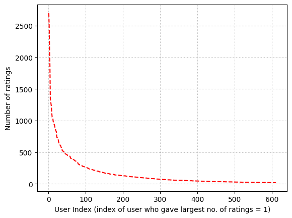
    


```python
user_count_dict = {} 
x = list(range(1,len(unique)+1))
for key in unique[np.argsort(counts)[::-1]]: 
    for value in x: 
        user_count_dict[key] = value 
        x.remove(value) 
        break 
print('Top 5 users who rated most number of times (User ID, Index):')
print(list(user_count_dict.items())[0:5])
```

    Top 5 users who rated most number of times (User ID, Index):
    [(414, 1), (599, 2), (474, 3), (448, 4), (274, 5)]
    

# Question 1 (E)

### Both the “number of ratings per movie” and the “number of ratings submitted per user” exhibit strongly skewed, roughly exponential‐like distributions. A small fraction of movies gather a large number of ratings, while many movies receive only a handful. Likewise, a small subset of users rates a large number of movies, but most users contribute few ratings. This behavior leads to data sparsity in the overall ratings matrix. Large portions of the matrix remain unobserved because many users rate only a few movies, and many movies receive only a few ratings. As a result, any recommendation approach trained on such data must handle potential overfitting for popular (highly rated) items, while still making reasonable predictions for items with very few ratings. Likewise, models must handle users who generate limited information (few ratings) without ignoring them. Techniques such as regularization, smoothing, or relying on broader patterns (e.g., latent factors, side information) become valuable to address the risk of overfitting “popular” items and under‐representing the long tail of rare movies (and less active users). In summary, skewed sitributions lead to:

### Limited Overlaps:
### Many items are rated by only a few users, and many users only rate a few items. This leaves large parts of the user–item rating matrix blank, making it difficult to draw confident inferences for less‐rated items or less‐active users.

### Dependence on “Power Users” and “Popular Items”:
### The small fraction of highly active users contributes most of the rating volume, which can bias the system toward items those active users prefer. Similarly, methods that rely on common items or users might mostly capture the tastes of the small set of popular items and prolific raters.

### Long‐Tail Challenge:
### The long tail of infrequently rated items (and less active users) is essential to recommendation diversity and novelty, but the system sees little direct data about them, risking poor coverage or irrelevant recommendations for rare items.

### Risk of Overfitting:
### If a model or strategy focuses too strongly on the few “popular” items or “power users,” it may overfit to a small subset of the data and fail to generalize well for the many sparsely rated items or lightly engaged users.

### Cold‐Start / Sparsity Issues:
### Movies with only a handful of ratings and users who have rated very few items fall under a “cold start.” Additional techniques or external data may be needed to handle their sparse information effectively.

### Implications:

### Recommender systems must often regularize or smooth estimates (e.g., weighting, damping, or Bayesian priors) to avoid overspecializing on high‐frequency signals.
### Systems may include auxiliary information (e.g., textual descriptions, metadata, user demographics, or other side information) to mitigate the sparse overlaps and produce recommendations even for relatively obscure items and less‐active users.
### Dimensionality‐reduction or latent factor methods often prove helpful, as they leverage broader patterns in the data rather than depending exclusively on exact user‐item overlaps, which can be scarce for the long tail.
### The exponential‐like distributions highlight why sparsity and long‐tail effects are fundamental challenges for designing and evaluating any recommender system.

# Question 1 (F)

### Histogram of the variances:


```python
unique_movie_ID = list(set(movie_ID))
movie_ID_list = []
var_list = []
for j in range(len(unique_movie_ID)):
    indices = [i for i, x in enumerate(movie_ID) if x == unique_movie_ID[j]]
    var = np.var(np.array(rating[indices]))
    movie_ID_list.append(unique_movie_ID[j])
    var_list.append(var)
```


```python
plt.hist(var_list, bins=np.arange(0,5.5,0.5),rwidth=0.75)
plt.xticks(np.arange(0.5,5.5,0.5))
plt.xlim([0, 5.5])
plt.grid(linestyle=':')
plt.xlabel('Variance')
plt.ylabel('Count of variance')
plt.savefig('../abhi_images/Q1F.png',dpi=300,bbox_inches='tight')
plt.show()
```


    
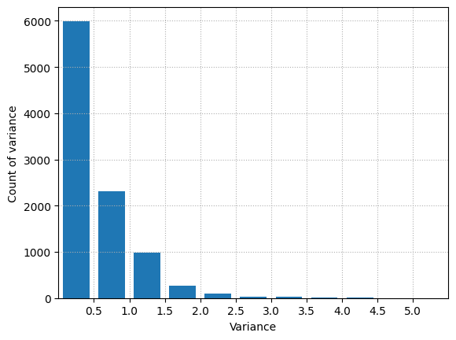
    


# Question 2

### Note this part has been rendered separately so that the LaTeX math notation doesn't change when converting to pdf.


# Question 3

### Centering each user’s ratings around their own average decreases user-specific bias and smooths out unusually high or low rating patterns. This is useful because some users consistently rate items near the top or bottom of the scale, whereas others spread their ratings across the entire range. By subtracting each user’s mean rating, we reduce variability caused by these individual rating tendencies, which in turn lowers noise and multicollinearity. Ultimately, mean-centering ensures that we focus on meaningful interactions among ratings rather than being skewed by outlier behavior or systematic bias from certain users.

# Question 4

### First we must clean the data a bit to remove the index column as it is not an attribute. Then we sweep our cross validation with k $ \in $ [2,100] and plot the avg. RMSE and MAE (one after the other) across all 10 folds for each k.


```python
df = pd.read_csv('../data/Synthetic_Movie_Lens/ratings.csv', index_col=0)
df = df.reset_index(drop=True)  # If the first column was just the old index
df.to_csv('../data/Synthetic_Movie_Lens/ratings_fixed.csv', index=False)
df.head()
```


<div>
<style scoped>
    .dataframe tbody tr th:only-of-type {
        vertical-align: middle;
    }

    .dataframe tbody tr th {
        vertical-align: top;
    }

    .dataframe thead th {
        text-align: right;
    }
</style>
<table border="1" class="dataframe">
  <thead>
    <tr style="text-align: right;">
      <th></th>
      <th>userId</th>
      <th>movieId</th>
      <th>rating</th>
      <th>timestamp</th>
    </tr>
  </thead>
  <tbody>
    <tr>
      <th>0</th>
      <td>496</td>
      <td>112852</td>
      <td>3.0</td>
      <td>1415520462</td>
    </tr>
    <tr>
      <th>1</th>
      <td>391</td>
      <td>1947</td>
      <td>4.0</td>
      <td>1030945141</td>
    </tr>
    <tr>
      <th>2</th>
      <td>387</td>
      <td>1562</td>
      <td>1.5</td>
      <td>1095041022</td>
    </tr>
    <tr>
      <th>3</th>
      <td>474</td>
      <td>2716</td>
      <td>4.5</td>
      <td>1053020930</td>
    </tr>
    <tr>
      <th>4</th>
      <td>483</td>
      <td>88125</td>
      <td>4.5</td>
      <td>1311337237</td>
    </tr>
  </tbody>
</table>
</div>


```python
reader = Reader(line_format='user item rating timestamp',sep=',',rating_scale=(0.5, 5),skip_lines=1)
ratings_dataset = Dataset.load_from_file(dataset_folder+"ratings_fixed.csv",reader=reader)
```


```python
k = np.arange(2,102,2)
rmse = []
mae = []
for item in k:
    print('Testing for k =',item)
    res = cross_validate(KNNWithMeans(k=item,sim_options={'name':'pearson', 'user_based': True}),
                         measures=['rmse','mae'],data = ratings_dataset,cv=10,n_jobs=-1)   
    rmse.append(np.mean(res['test_rmse']))
    mae.append(np.mean(res['test_mae']))
```

    Testing for k = 2
    Testing for k = 4
    Testing for k = 6
    Testing for k = 8
    Testing for k = 10
    Testing for k = 12
    Testing for k = 14
    Testing for k = 16
    Testing for k = 18
    Testing for k = 20
    Testing for k = 22
    Testing for k = 24
    Testing for k = 26
    Testing for k = 28
    Testing for k = 30
    Testing for k = 32
    Testing for k = 34
    Testing for k = 36
    Testing for k = 38
    Testing for k = 40
    Testing for k = 42
    Testing for k = 44
    Testing for k = 46
    Testing for k = 48
    Testing for k = 50
    Testing for k = 52
    Testing for k = 54
    Testing for k = 56
    Testing for k = 58
    Testing for k = 60
    Testing for k = 62
    Testing for k = 64
    Testing for k = 66
    Testing for k = 68
    Testing for k = 70
    Testing for k = 72
    Testing for k = 74
    Testing for k = 76
    Testing for k = 78
    Testing for k = 80
    Testing for k = 82
    Testing for k = 84
    Testing for k = 86
    Testing for k = 88
    Testing for k = 90
    Testing for k = 92
    Testing for k = 94
    Testing for k = 96
    Testing for k = 98
    Testing for k = 100
    


```python
plt.plot(k,rmse,linestyle='--',color='r')
plt.grid(linestyle=':')
plt.ylabel('Avg. RMSE')
plt.xlabel('Number of neighbours')
plt.savefig('../abhi_images/Q4A.png',dpi=300,bbox_inches='tight')
plt.show()
```


    
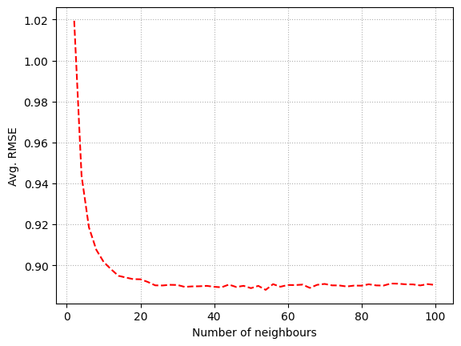
    


```python
plt.plot(k,mae,linestyle='--',color='b')
plt.grid(linestyle=':')
plt.ylabel('Avg. MAE')
plt.xlabel('Number of neighbours')
plt.savefig('../abhi_images/Q4B.png',dpi=300,bbox_inches='tight')
plt.show()
```


    
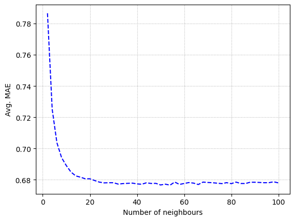
    


# Question 5

### Judging from the curves in Question 4, we see that the steady state occurs at k = 20, with the steady-state RMSE = 0.8926 and steady-state MAE = 0.6799. So, k = 20 is our 'minimum k'


```python
print(f'RMSE at k=20: {rmse[9]}')
print(f'MAE at k=20: {mae[9]}')
```

    RMSE at k=20: 0.8931874735689023
    MAE at k=20: 0.6806297276068325
    

# Question 6

### The avg RMSE across all folds vs k is plotted, and the min avg RMSE and the corresponding k values are printed for each trimmed subset of our data. After that we use the k's corresponding to the min avg RMSE for each subset (and k = 20 for full untrimmed data) to plot their ROCs (4 plots with all 4 thresholds on each plot). Min avg RMSE values are summarised in the following table:

| **Subset**        | **Best k** | **Min Avg RMSE** |
|-------------------|-----------:|-----------------:|
| **Popular**       | 42         | 0.8702           |
| **Unpopular**     | 2          | 1.0637           |
| **High-Variance** | 2          | 1.5038           |


```python
import numpy as np
import pandas as pd
import matplotlib.pyplot as plt
from collections import defaultdict
from tqdm import tqdm
from surprise import Dataset, Reader, KNNWithMeans, accuracy
from surprise.model_selection import KFold

def trim_data(raw_data, method='popular', rating_threshold=2, var_threshold=2.0, min_var_count=5):
    item_ratings = defaultdict(list)
    for (u, i, r, t) in raw_data:
        item_ratings[i].append(r)
    if method == 'popular':
        keep_items = {i for i, rlist in item_ratings.items() if len(rlist) > rating_threshold}
    elif method == 'unpopular':
        keep_items = {i for i, rlist in item_ratings.items() if len(rlist) <= rating_threshold}
    elif method == 'high_variance':
        keep_items = []
        for i, rlist in item_ratings.items():
            if len(rlist) >= min_var_count and np.var(rlist) >= var_threshold:
                keep_items.append(i)
        keep_items = set(keep_items)
    else:
        raise ValueError("method must be 'popular', 'unpopular', or 'high_variance'")
    trimmed = [(u, i, r, t) for (u, i, r, t) in raw_data if i in keep_items]
    return trimmed

def evaluate_knn_for_subset(trimmed_raw_data, k_values, user_based=True):
    df = pd.DataFrame(trimmed_raw_data, columns=['userID','itemID','rating','timestamp'])
    reader = Reader(rating_scale=(0.5, 5))
    data = Dataset.load_from_df(df[['userID','itemID','rating']], reader)
    kf = KFold(n_splits=10, random_state=0, shuffle=True)
    rmse_results = []
    for k in tqdm(k_values, desc="k-sweep"):
        fold_rmse = []
        for trainset, testset in tqdm(kf.split(data), desc=f"(k={k}) folds", leave=False):
            algo = KNNWithMeans(k=k, sim_options={'name': 'pearson','user_based': user_based}, verbose=False)
            algo.fit(trainset)
            predictions = algo.test(testset)
            fold_rmse.append(accuracy.rmse(predictions, verbose=False))
        rmse_results.append(np.mean(fold_rmse))
    return rmse_results

full_data_raw = ratings_dataset.raw_ratings
popular_data_raw = trim_data(full_data_raw, method='popular', rating_threshold=2)
unpopular_data_raw = trim_data(full_data_raw, method='unpopular', rating_threshold=2)
high_var_data_raw = trim_data(full_data_raw, method='high_variance', var_threshold=2.0, min_var_count=5)

k_values = list(range(2, 101, 2))

rmse_popular = evaluate_knn_for_subset(popular_data_raw, k_values, user_based=True)
best_k_popular = k_values[np.argmin(rmse_popular)]
best_rmse_popular = min(rmse_popular)
print("=== Popular Subset ===")
print(f"Best k: {best_k_popular}, Min Avg RMSE: {best_rmse_popular:.4f}")
plt.figure(figsize=(6,4))
plt.plot(k_values, rmse_popular, marker='o')
plt.title("RMSE vs. k (Popular Subset)")
plt.xlabel("k (neighbors)")
plt.ylabel("10-fold Avg RMSE")
plt.show()

rmse_unpopular = evaluate_knn_for_subset(unpopular_data_raw, k_values, user_based=True)
best_k_unpopular = k_values[np.argmin(rmse_unpopular)]
best_rmse_unpopular = min(rmse_unpopular)
print("=== Unpopular Subset ===")
print(f"Best k: {best_k_unpopular}, Min Avg RMSE: {best_rmse_unpopular:.4f}")
plt.figure(figsize=(6,4))
plt.plot(k_values, rmse_unpopular, marker='o', color='orange')
plt.title("RMSE vs. k (Unpopular Subset)")
plt.xlabel("k (neighbors)")
plt.ylabel("10-fold Avg RMSE")
plt.show()

rmse_highvar = evaluate_knn_for_subset(high_var_data_raw, k_values, user_based=True)
best_k_highvar = k_values[np.argmin(rmse_highvar)]
best_rmse_highvar = min(rmse_highvar)
print("=== High-Variance Subset ===")
print(f"Best k: {best_k_highvar}, Min Avg RMSE: {best_rmse_highvar:.4f}")
plt.figure(figsize=(6,4))
plt.plot(k_values, rmse_highvar, marker='o', color='green')
plt.title("RMSE vs. k (High-Variance Subset)")
plt.xlabel("k (neighbors)")
plt.ylabel("10-fold Avg RMSE")
plt.show()

```

    k-sweep: 100%|██████████| 50/50 [19:28<00:00, 23.37s/it]

    === Popular Subset ===
    Best k: 42, Min Avg RMSE: 0.8702
    

    
    


    

    


    k-sweep: 100%|██████████| 50/50 [00:26<00:00,  1.87it/s]
    

    === Unpopular Subset ===
    Best k: 2, Min Avg RMSE: 1.0637
    


    

    


    k-sweep: 100%|██████████| 50/50 [00:02<00:00, 22.29it/s]
    

    === High-Variance Subset ===
    Best k: 2, Min Avg RMSE: 1.5038
    


    
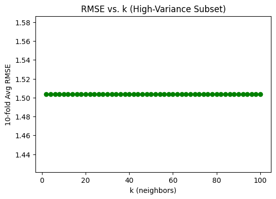
    


```python
thres=[2.5,3.0,3.5,4.0]
raw_full=ratings_dataset.raw_ratings
df_full=pd.DataFrame(raw_full,columns=['u','i','r','t'])
reader=Reader(rating_scale=(0.5,5))
data_full=Dataset.load_from_df(df_full[['u','i','r']],reader)
trainf,testf=train_test_split(data_full,test_size=0.1)
algof=KNNWithMeans(k=20,sim_options={'name':'pearson'},verbose=False).fit(trainf)
resf=algof.test(testf)
fig,ax=plt.subplots()
for x in thres:
    y=[1 if row.r_ui>x else 0 for row in resf]
    fpr,tpr,_=roc_curve(y,[row.est for row in resf])
    ax.plot(fpr,tpr,label="AUC="+str(auc(fpr,tpr))+", thr="+str(x))
ax.plot([0,1],[0,1],'--',color='g',alpha=.5)
plt.legend(loc='best')
plt.grid(linestyle=':')
plt.title('No Trimming (k=20)')
plt.xlabel('FPR')
plt.ylabel('TPR')
plt.show()

raw_pop=trim_data(raw_full,'popular',2)
df_pop=pd.DataFrame(raw_pop,columns=['u','i','r','t'])
data_pop=Dataset.load_from_df(df_pop[['u','i','r']],reader)
trainp,testp=train_test_split(data_pop,test_size=0.1)
algop=KNNWithMeans(k=best_k_popular,sim_options={'name':'pearson'},verbose=False).fit(trainp)
resp=algop.test(testp)
fig,ax=plt.subplots()
for x in thres:
    y=[1 if row.r_ui>x else 0 for row in resp]
    fpr,tpr,_=roc_curve(y,[row.est for row in resp])
    ax.plot(fpr,tpr,label="AUC="+str(auc(fpr,tpr))+", thr="+str(x))
ax.plot([0,1],[0,1],'--',color='g',alpha=.5)
plt.legend(loc='best')
plt.grid(linestyle=':')
plt.title(f'Popular (k={best_k_popular})')
plt.xlabel('FPR')
plt.ylabel('TPR')
plt.show()

raw_unp=trim_data(raw_full,'unpopular',2)
df_unp=pd.DataFrame(raw_unp,columns=['u','i','r','t'])
data_unp=Dataset.load_from_df(df_unp[['u','i','r']],reader)
trainu,testu=train_test_split(data_unp,test_size=0.1)
algou=KNNWithMeans(k=best_k_unpopular,sim_options={'name':'pearson'},verbose=False).fit(trainu)
resu=algou.test(testu)
fig,ax=plt.subplots()
for x in thres:
    y=[1 if row.r_ui>x else 0 for row in resu]
    fpr,tpr,_=roc_curve(y,[row.est for row in resu])
    ax.plot(fpr,tpr,label="AUC="+str(auc(fpr,tpr))+", thr="+str(x))
ax.plot([0,1],[0,1],'--',color='g',alpha=.5)
plt.legend(loc='best')
plt.grid(linestyle=':')
plt.title(f'Unpopular (k={best_k_unpopular})')
plt.xlabel('FPR')
plt.ylabel('TPR')
plt.show()

raw_hv=trim_data(raw_full,'high_variance',2,2.0,5)
df_hv=pd.DataFrame(raw_hv,columns=['u','i','r','t'])
data_hv=Dataset.load_from_df(df_hv[['u','i','r']],reader)
trainh,testh=train_test_split(data_hv,test_size=0.1)
algoh=KNNWithMeans(k=best_k_highvar,sim_options={'name':'pearson'},verbose=False).fit(trainh)
resh=algoh.test(testh)
fig,ax=plt.subplots()
for x in thres:
    y=[1 if row.r_ui>x else 0 for row in resh]
    fpr,tpr,_=roc_curve(y,[row.est for row in resh])
    ax.plot(fpr,tpr,label="AUC="+str(auc(fpr,tpr))+", thr="+str(x))
ax.plot([0,1],[0,1],'--',color='g',alpha=.5)
plt.legend(loc='best')
plt.grid(linestyle=':')
plt.title(f'High Variance (k={best_k_highvar})')
plt.xlabel('FPR')
plt.ylabel('TPR')
plt.show()
```


    
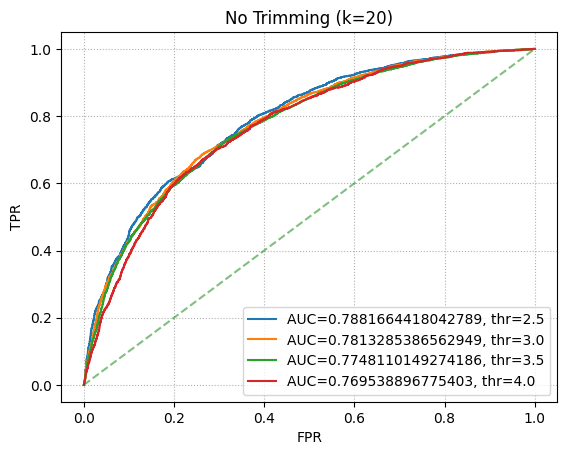
    


    
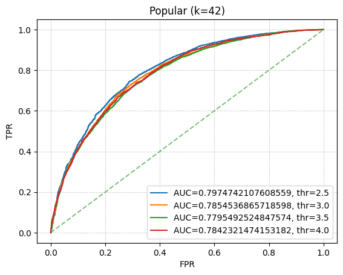
    


    
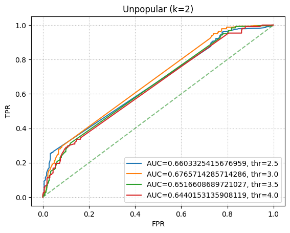
    


    

    


# Question 7

### Note this part has been rendered separately so that the LaTeX math notation doesn't change when converting to pdf.


# Question 8

# PART A

### Plots can be found below:


```python
k = np.arange(2,52,2)
rmse_NMF_50 = []
mae_NMF_50 = []
for item in k:
    print('Testing for k =',item)
    res = cross_validate(NMF(n_factors=item,n_epochs=50,verbose=False),
                         measures=['rmse','mae'],data = ratings_dataset,cv=10,n_jobs=-1)   
    rmse_NMF_50.append(np.mean(res['test_rmse']))
    mae_NMF_50.append(np.mean(res['test_mae']))
```

    Testing for k = 2
    Testing for k = 4
    Testing for k = 6
    Testing for k = 8
    Testing for k = 10
    Testing for k = 12
    Testing for k = 14
    Testing for k = 16
    Testing for k = 18
    Testing for k = 20
    Testing for k = 22
    Testing for k = 24
    Testing for k = 26
    Testing for k = 28
    Testing for k = 30
    Testing for k = 32
    Testing for k = 34
    Testing for k = 36
    Testing for k = 38
    Testing for k = 40
    Testing for k = 42
    Testing for k = 44
    Testing for k = 46
    Testing for k = 48
    Testing for k = 50
    


```python
plt.plot(k,rmse_NMF_50,linestyle='--',color='r')
plt.grid(linestyle=':')
plt.title('Avg. RMSE for NMF')
plt.ylabel('Avg. RMSE')
plt.xlabel('Number of latent factors')
#plt.savefig('../abhi_images/Q8A_RMSE.png',dpi=300,bbox_inches='tight')
plt.show()

plt.plot(k,mae_NMF_50,linestyle='--',color='b')
plt.grid(linestyle=':')
plt.title('Avg. MAE for NMF')
plt.ylabel('Avg. MAE')
plt.xlabel('Number of latent factors')
#plt.savefig('../abhi_images/Q8A_MAE.png',dpi=300,bbox_inches='tight')
plt.show()

```


    

    


    

    


```python
print("Minimum avg. RMSE (NMF): %f, value of k: %d" % (min(rmse_NMF_50),k[np.argmin(rmse_NMF_50)]))
print("Minimum avg. MAE (NMF): %f, value of k: %d" % (min(mae_NMF_50), k[np.argmin(mae_NMF_50)]))
```

    Minimum avg. RMSE (NMF): 0.911686, value of k: 18
    Minimum avg. MAE (NMF): 0.693172, value of k: 18
    

# PART B

### Since both RMSE and MAE plots reveal that the optimal k (which returns minimum value for both) is k = 18, we shall use this as out optimal value to plot the ROC - further, this value is actually close to the number of genres that was printed at the start of this report.

# PART C

### The plots can be seen below and the min avg RMSE and corresponding k values are summarised below:


| **Subset** | **Best k** | **Min RMSE** |
|------------|-----------|--------------|
| Popular    | 20        | 0.8938076299869282 |
| Unpopular  | 44        | 1.1340514349876818 |
| High Var   | 20        | 1.5726049136610523 |

### Note that we are using the best k's to plot the ROC


```python
from tqdm import tqdm

def trim_data(raw_data, method='popular', rating_threshold=2, var_threshold=2.0, min_var_count=5):
    d = defaultdict(list)
    for (u,i,r,t) in raw_data:
        d[i].append(r)
    if method == 'popular':
        keep = {i for i in d if len(d[i]) > rating_threshold}
    elif method == 'unpopular':
        keep = {i for i in d if len(d[i]) <= rating_threshold}
    elif method == 'high_variance':
        keep = []
        for i in d:
            if len(d[i]) >= min_var_count and np.var(d[i]) >= var_threshold:
                keep.append(i)
        keep = set(keep)
    else:
        raise ValueError
    return [(u,i,r,t) for (u,i,r,t) in raw_data if i in keep]

def evaluate_nmf_10fold(trimmed_raw_data):
    df = pd.DataFrame(trimmed_raw_data, columns=['userID','itemID','rating','timestamp'])
    reader = Reader(rating_scale=(0.5, 5))
    data = Dataset.load_from_df(df[['userID','itemID','rating']], reader)
    k_values = range(2, 51, 2)
    kf = KFold(n_splits=10, random_state=0, shuffle=True)
    rmse_results = []
    for k in tqdm(k_values, desc="Sweeping factors"):
        fold_rmse = []
        for trainset, testset in kf.split(data):
            algo = NMF(n_factors=k, n_epochs=50, verbose=False)
            algo.fit(trainset)
            preds = algo.test(testset)
            fold_rmse.append(accuracy.rmse(preds, verbose=False))
        rmse_results.append(np.mean(fold_rmse))
    return k_values, rmse_results, df

def plot_roc_nmf(df, best_k, title):
    reader = Reader(rating_scale=(0.5, 5))
    data = Dataset.load_from_df(df[['userID','itemID','rating']], reader)
    trainset, testset = train_test_split(data, test_size=0.1, random_state=0)
    algo = NMF(n_factors=best_k, n_epochs=50, verbose=False)
    algo.fit(trainset)
    preds = algo.test(testset)
    thresholds = [2.5, 3.0, 3.5, 4.0]
    fig, ax = plt.subplots()
    for t in thresholds:
        y_true = [1 if p.r_ui > t else 0 for p in preds]
        y_score = [p.est for p in preds]
        fpr, tpr, _ = roc_curve(y_true, y_score)
        ax.plot(fpr, tpr, label="AUC="+str(auc(fpr,tpr))+", thr="+str(t))
    ax.plot([0,1],[0,1],'--',color='g',alpha=.5)
    plt.legend(loc='best')
    plt.title(title)
    plt.xlabel("FPR")
    plt.ylabel("TPR")
    plt.grid(linestyle=':')
    plt.show()

raw_data = ratings_dataset.raw_ratings

df_full = pd.DataFrame(raw_data, columns=['userID','itemID','rating','timestamp'])
reader = Reader(rating_scale=(0.5, 5))
data_full = Dataset.load_from_df(df_full[['userID','itemID','rating']], reader)
plot_roc_nmf(df_full, 18, "No-Trim NMF ROC (k=18)")

pop_data = trim_data(raw_data, 'popular', 2)
kp, rp, dfp = evaluate_nmf_10fold(pop_data)
best_kp = kp[np.argmin(rp)]
plt.plot(kp, rp, marker='o')
plt.title('Popular NMF')
plt.xlabel('Factors')
plt.ylabel('Avg RMSE')
plt.show()
print("Popular best factors:", best_kp, "Min RMSE:", min(rp))
plot_roc_nmf(dfp, best_kp, 'Popular NMF ROC')

unp_data = trim_data(raw_data, 'unpopular', 2)
ku, ru, dfu = evaluate_nmf_10fold(unp_data)
best_ku = ku[np.argmin(ru)]
plt.plot(ku, ru, marker='o')
plt.title('Unpopular NMF')
plt.xlabel('Factors')
plt.ylabel('Avg RMSE')
plt.show()
print("Unpopular best factors:", best_ku, "Min RMSE:", min(ru))
plot_roc_nmf(dfu, best_ku, 'Unpopular NMF ROC')

hv_data = trim_data(raw_data, 'high_variance', 2, 2.0, 5)
kh, rh, dfh = evaluate_nmf_10fold(hv_data)
best_kh = kh[np.argmin(rh)]
plt.plot(kh, rh, marker='o')
plt.title('High-Variance NMF')
plt.xlabel('Factors')
plt.ylabel('Avg RMSE')
plt.show()
print("High Var best factors:", best_kh, "Min RMSE:", min(rh))
plot_roc_nmf(dfh, best_kh, 'High-Variance NMF ROC')

```


    
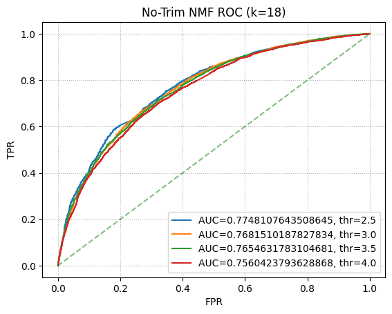
    


    Sweeping factors: 100%|██████████| 25/25 [38:19<00:00, 91.98s/it] 
    


    
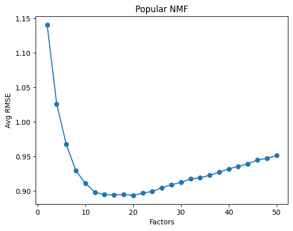
    


    Popular best factors: 20 Min RMSE: 0.8938076299869282
    


    

    


    Sweeping factors: 100%|██████████| 25/25 [04:42<00:00, 11.29s/it]
    


    
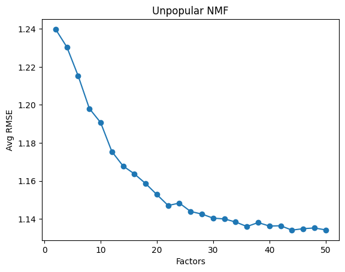
    


    Unpopular best factors: 44 Min RMSE: 1.1340514349876818
    


    
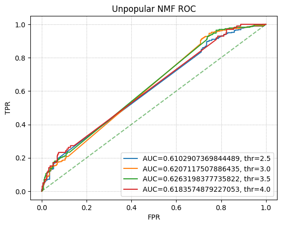
    


    Sweeping factors: 100%|██████████| 25/25 [00:08<00:00,  2.83it/s]
    


    

    


    High Var best factors: 20 Min RMSE: 1.5726049136610523
    


    
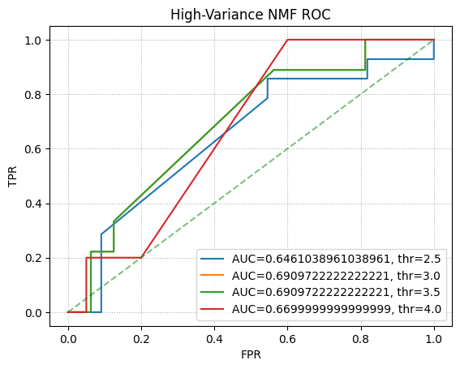
    


# Question 9

### We plot the top 10 for each column below. 

### From the genre list, we see that the top 10 movies in each column of V tend to belong to a small, focused set of genres. For example:

### Latent Factor 8 features many Comedy titles (e.g., “Comedy”, “Comedy|Crime”).
### Latent Factor 17 frequently highlights Action, and Horror motifs (e.g., “Horror|Thriller”, “Action|Crime|Drama|Thriller”).
### These clusters suggest that each latent factor captures a specific “theme” or “genre blend.” Items grouped under the same factor often share overlapping genres, indicating that the factorization naturally organizes movies by genre or broader thematic elements that users rate similarly.


```python
genre = pd.read_csv(dataset_folder+'movies.csv',usecols=['movieId','title','genres'])
trainset, testset = train_test_split(ratings_dataset, test_size=0.1)
nmf = NMF(n_factors=20,n_epochs=50,verbose=False)
nmf.fit(trainset).test(testset)
U = nmf.pu
V = nmf.qi

cols = [i for i in range(20)]
for item in cols:
    print('Column number of V: ',item)
    selected_col = V[:,item]
    sorted_col = np.argsort(selected_col)[::-1]
    for i in sorted_col[0:10]:
        print(genre['genres'][i])
    print('---------------------------------------------')
```

    Column number of V:  0
    Comedy
    Drama
    Drama|Romance
    Comedy
    Adventure|Drama|Sci-Fi
    Action|Comedy|Drama|War
    Action|Adventure|Comedy|Sci-Fi
    Documentary
    Comedy|Drama|Romance
    Comedy|Drama|Romance
    ---------------------------------------------
    Column number of V:  1
    Adventure|Sci-Fi|Thriller
    Comedy
    Crime|Drama|Thriller
    Action|Horror|Thriller
    Drama|Mystery
    Drama
    Action|Crime
    Action|Drama|Romance|War
    Comedy
    Comedy|Drama|Romance
    ---------------------------------------------
    Column number of V:  2
    Comedy|Romance
    Action|Sci-Fi
    Comedy|Crime
    Action|Adventure|Drama|Thriller
    Thriller
    Drama|Romance
    Musical
    Comedy
    Drama|Romance
    Mystery|Thriller
    ---------------------------------------------
    Column number of V:  3
    Action|Crime|Drama|Thriller
    Comedy|Drama|Romance
    Comedy|Drama
    Drama
    Adventure|Drama|Romance
    Action|Drama|Thriller
    Drama|War
    Action|Comedy|Crime|Drama
    Comedy|Drama
    Adventure|Comedy|Thriller
    ---------------------------------------------
    Column number of V:  4
    Horror
    Comedy|Romance
    Adventure|Children|Fantasy
    Drama|Fantasy
    Children|Comedy|Fantasy
    Drama|Mystery|Thriller
    Drama
    Action|Drama|Romance|War
    Action|Comedy
    Drama
    ---------------------------------------------
    Column number of V:  5
    Drama|Romance
    Comedy
    Comedy|Drama
    Fantasy|Mystery|Western
    Action|Comedy|Western
    Comedy|Crime
    Drama|Mystery|Romance
    Drama|Film-Noir|Romance
    Comedy|Crime
    Adventure
    ---------------------------------------------
    Column number of V:  6
    Action|Fantasy|Thriller
    Drama|Fantasy
    Action|Crime|Thriller
    Drama
    Comedy
    Drama|Thriller
    Comedy|Horror
    Comedy|Drama
    Action|Thriller
    Adventure|Animation|Children|Comedy|Fantasy
    ---------------------------------------------
    Column number of V:  7
    Documentary
    Horror|Sci-Fi|Thriller
    Drama
    Drama
    Adventure|Children|Fantasy|Sci-Fi
    Action|Adventure|Sci-Fi|Thriller
    Comedy|Crime
    Drama
    Horror|Mystery|Thriller
    Action|Thriller
    ---------------------------------------------
    Column number of V:  8
    Comedy|Drama|Romance
    Adventure|Comedy|Drama
    Comedy
    Drama
    Drama|Western
    Drama|Mystery
    Comedy
    Comedy|Crime
    Comedy
    Comedy|Horror
    ---------------------------------------------
    Column number of V:  9
    Comedy|Drama|Romance
    Horror
    Drama|Romance
    Animation|Comedy|Musical
    Horror|Sci-Fi
    Thriller
    Comedy
    Adventure|Animation|Children|Comedy
    Comedy
    Crime|Drama|Film-Noir
    ---------------------------------------------
    Column number of V:  10
    Crime|Drama
    Action|Comedy|Western
    Comedy|Drama
    Comedy|Documentary|Musical
    Fantasy|Horror|Thriller
    Adventure|Comedy|Thriller
    Action|Adventure|Sci-Fi
    Children|Comedy|Mystery
    Drama
    Comedy|Drama
    ---------------------------------------------
    Column number of V:  11
    Action|Sci-Fi|War
    Action|Crime|Drama
    Thriller
    Comedy|Drama|Romance
    Adventure|Western
    Comedy|Drama
    Action|Comedy|Western
    Drama
    Comedy|Romance
    Drama|Musical
    ---------------------------------------------
    Column number of V:  12
    Action|Fantasy|Thriller
    Adventure|Children|Fantasy
    Comedy|Horror
    Drama
    Comedy|Romance
    Action|Adventure|Sci-Fi|Thriller
    Documentary
    Comedy|Drama
    Action|Drama|War
    Crime|Drama
    ---------------------------------------------
    Column number of V:  13
    Musical
    Animation|Children|Comedy
    Comedy
    Horror|Thriller
    Action|Crime|Thriller
    Action|Sci-Fi
    Action|Comedy|Crime|Drama
    Comedy|Drama|Romance|Thriller
    Action|Crime|Drama|Thriller
    Crime|Drama|Romance|Thriller
    ---------------------------------------------
    Column number of V:  14
    Comedy|Horror
    Action|Horror|Thriller
    Adventure|Children
    Action|Drama
    Comedy|Drama|Musical
    Adventure|Comedy|Crime|Drama|Romance
    Comedy|Fantasy
    Action|Crime
    Comedy|Crime|Drama|War
    Adventure|Animation|Children|Comedy|Fantasy|Romance
    ---------------------------------------------
    Column number of V:  15
    Drama
    Comedy|Drama|Romance
    Comedy
    Comedy|Drama|Romance
    Action|Crime
    Drama
    Musical
    Comedy|Crime
    Drama|Romance
    Comedy|Romance
    ---------------------------------------------
    Column number of V:  16
    Action|Crime|Drama|Thriller
    Adventure|Drama|Romance
    Crime|Drama|Fantasy
    Action|Comedy|Crime|Thriller
    Drama
    Drama|Thriller
    Comedy|Romance
    Drama
    Action|Adventure|Sci-Fi|Thriller|IMAX
    Drama|Romance
    ---------------------------------------------
    Column number of V:  17
    Horror|Thriller
    Action|Crime
    Action|Crime|Drama|Thriller
    Action|Adventure|Thriller
    Horror|Mystery
    Comedy
    Comedy
    Drama|Mystery|Thriller
    Horror|Sci-Fi|Thriller
    Drama
    ---------------------------------------------
    Column number of V:  18
    Documentary
    Comedy|Drama
    Comedy
    Comedy|Drama|Romance
    Drama|Romance
    Drama|Romance|Sci-Fi
    Documentary
    Comedy|Drama|Musical
    Drama
    Adventure|Drama
    ---------------------------------------------
    Column number of V:  19
    Drama|Romance
    Action|Thriller
    Action|Adventure|Crime|Thriller
    Action|Drama|War
    Comedy|Fantasy|Romance
    Documentary
    Comedy
    Horror|Thriller
    Comedy
    Drama|Thriller
    ---------------------------------------------
    

# Question 10

### Plots are reported one after another for full-data, popular, unpopular and high-variance subsets respectively. RMSE and MAE results are summarised as follows:

**Full Data**  
- Min RMSE = 0.8652 at k = 26  
- Min MAE  = 0.6642 at k = 36  
- Chosen k (closest to 19 unique genres) = 26

| Subset     | Best k (RMSE) | Min RMSE | Best k (MAE) | Min MAE | Chosen k |
|------------|:------------:|:--------:|:------------:|:-------:|:--------:|
| Full Data  | 26           | 0.8652   | 36           | 0.6642  | 26       |

---

**Popular Subset**  
- Best RMSE = 0.8559 at k = 32

**Unpopular Subset**  
- Best RMSE = 0.8953 at k = 6

**High-Variance Subset**  
- Best RMSE = 1.5611 at k = 40

| Subset          | Best k | Min RMSE |
|-----------------|:------:|:--------:|
| Popular         | 32     | 0.8559   |
| Unpopular       | 6      | 0.8953   |
| High-Variance   | 40     | 1.5611   |


```python
import numpy as np
import pandas as pd
import matplotlib.pyplot as plt
from tqdm import tqdm
from surprise import SVD, Dataset, Reader, accuracy
from surprise.model_selection import cross_validate, train_test_split, KFold
from sklearn.metrics import roc_curve, auc

k_values = np.arange(2,52,2)
rmse_SVD = []
mae_SVD = []
for k in tqdm(k_values,desc="Full Data k-sweep"):
    res = cross_validate(
        SVD(n_factors=k,n_epochs=20,verbose=False),
        data=ratings_dataset,
        measures=['rmse','mae'],
        cv=10,
        n_jobs=-1
    )
    rmse_SVD.append(np.mean(res['test_rmse']))
    mae_SVD.append(np.mean(res['test_mae']))

min_rmse_full = min(rmse_SVD)
min_mae_full = min(mae_SVD)
best_k_rmse = k_values[np.argmin(rmse_SVD)]
best_k_mae = k_values[np.argmin(mae_SVD)]

def dist19(x): return abs(x-19)
chosen_k = min([best_k_rmse,best_k_mae], key=dist19)

print(f"Full Data - Min RMSE={min_rmse_full:.4f} at k={best_k_rmse}")
print(f"Full Data - Min MAE ={min_mae_full:.4f} at k={best_k_mae}")
print(f"Chosen k by closeness to 19: {chosen_k}")

plt.plot(k_values,rmse_SVD,marker='o')
plt.title("RMSE vs k (Full Data) [10-fold CV]")
plt.xlabel("k")
plt.ylabel("RMSE")
plt.show()

plt.plot(k_values,mae_SVD,marker='o',color='orange')
plt.title("MAE vs k (Full Data) [10-fold CV]")
plt.xlabel("k")
plt.ylabel("MAE")
plt.show()

trainset, testset = train_test_split(ratings_dataset, test_size=0.1, random_state=0)
algo = SVD(n_factors=chosen_k, n_epochs=20, verbose=False, random_state=0)
algo.fit(trainset)
predictions = algo.test(testset)

thresholds = [2.5,3,3.5,4]
plt.figure()
for t in thresholds:
    y_true = [1 if p.r_ui>t else 0 for p in predictions]
    y_score = [p.est for p in predictions]
    fpr, tpr, _ = roc_curve(y_true, y_score)
    plt.plot(fpr, tpr, label=f"AUC={auc(fpr,tpr):.3f}, thr={t}")
plt.plot([0,1],[0,1],'--',color='gray',alpha=0.6)
plt.xlabel("FPR")
plt.ylabel("TPR")
plt.title(f"ROC (k={chosen_k}) - Full Data")
plt.legend(loc='best')
plt.grid(linestyle=':')
plt.show()

def trim_data(raw_data,method='popular',rating_threshold=2,var_threshold=2.0,min_var_count=5):
    from collections import defaultdict
    d = defaultdict(list)
    for (u,i,r,t) in raw_data:
        d[i].append(r)
    if method=='popular':
        keep = {i for i in d if len(d[i])>rating_threshold}
    elif method=='unpopular':
        keep = {i for i in d if len(d[i])<=rating_threshold}
    elif method=='high_variance':
        keep = []
        for i in d:
            if len(d[i])>=min_var_count and np.var(d[i])>=var_threshold:
                keep.append(i)
        keep = set(keep)
    else:
        raise ValueError("Unknown trim method")
    return [(u,i,r,t) for (u,i,r,t) in raw_data if i in keep]

def to_dataset(data):
    df = pd.DataFrame(data,columns=['userID','itemID','rating','timestamp'])
    return Dataset.load_from_df(df[['userID','itemID','rating']],Reader(rating_scale=(0.5,5)))

pop_dataset = to_dataset(trim_data(ratings_dataset.raw_ratings,'popular',2))
unp_dataset = to_dataset(trim_data(ratings_dataset.raw_ratings,'unpopular',2))
hv_dataset  = to_dataset(trim_data(ratings_dataset.raw_ratings,'high_variance',2,2.0,5))

def process_subset(ds,title):
    kf = KFold(n_splits=10,shuffle=True,random_state=0)
    kvals = np.arange(2,52,2)
    mean_rmses = []
    for k in tqdm(kvals,desc=f"{title} k-sweep"):
        fold_rmses = []
        for trn,tst in tqdm(kf.split(ds),desc=f"{title} folds for k={k}",leave=False):
            algo = SVD(n_factors=k,n_epochs=20,verbose=False, random_state=0)
            algo.fit(trn)
            preds = algo.test(tst)
            fold_rmses.append(accuracy.rmse(preds,verbose=False))
        mean_rmses.append(np.mean(fold_rmses))
    bestk = kvals[np.argmin(mean_rmses)]
    min_rmse = min(mean_rmses)
    print(f"{title} Subset - Best RMSE={min_rmse:.4f} at k={bestk}")
    plt.plot(kvals,mean_rmses,marker='o')
    plt.title(f"{title} - RMSE vs k (10-fold CV)")
    plt.xlabel("k")
    plt.ylabel("RMSE")
    plt.show()
    trn2,tst2 = train_test_split(ds,test_size=0.1,random_state=0)
    algo = SVD(n_factors=bestk,n_epochs=20,verbose=False, random_state=0)
    algo.fit(trn2)
    preds = algo.test(tst2)
    thresholds = [2.5,3,3.5,4]
    plt.figure()
    for thr in thresholds:
        y_true = [1 if p.r_ui>thr else 0 for p in preds]
        y_score = [p.est for p in preds]
        fpr,tpr,_ = roc_curve(y_true,y_score)
        plt.plot(fpr,tpr,label=f"AUC={auc(fpr,tpr):.3f}, thr={thr}")
    plt.plot([0,1],[0,1],'--',color='gray',alpha=0.6)
    plt.title(f"{title} ROC (k={bestk})")
    plt.legend(loc='best')
    plt.grid(linestyle=':')
    plt.show()

process_subset(pop_dataset,"Popular")
process_subset(unp_dataset,"Unpopular")
process_subset(hv_dataset,"High-Variance")

```

    Full Data k-sweep: 100%|██████████| 25/25 [10:08<00:00, 24.35s/it]

    Full Data - Min RMSE=0.8652 at k=26
    Full Data - Min MAE =0.6642 at k=36
    Chosen k by closeness to 19: 26
    

    
    


    
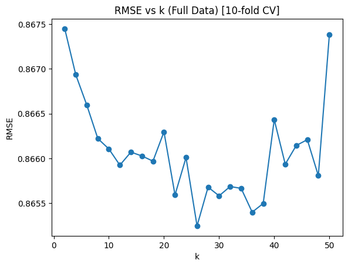
    


    

    


    
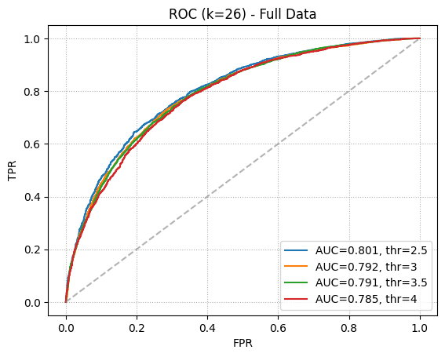
    


    Popular k-sweep: 100%|██████████| 25/25 [13:57<00:00, 33.50s/it]

    Popular Subset - Best RMSE=0.8559 at k=32
    

    
    


    
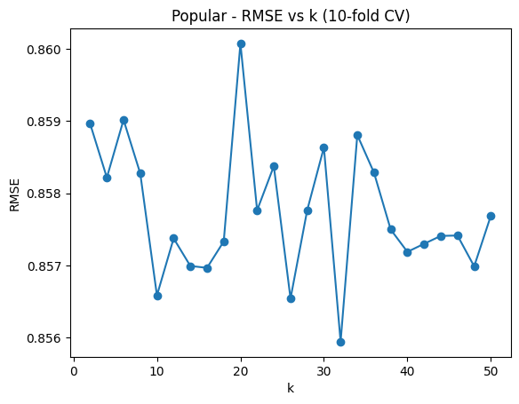
    


    
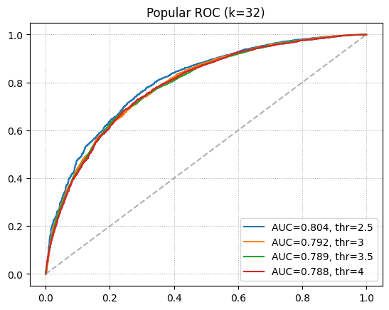
    


    Unpopular k-sweep: 100%|██████████| 25/25 [00:52<00:00,  2.08s/it]

    Unpopular Subset - Best RMSE=0.8953 at k=6
    

    
    


    

    


    

    


    High-Variance k-sweep: 100%|██████████| 25/25 [00:02<00:00, 11.99it/s]
    

    High-Variance Subset - Best RMSE=1.5611 at k=40
    


    

    


    

    


# Question 11

### Summary of results:

| **Subset**     | **10-fold CV Avg RMSE** |
|----------------|-------------------------|
| Full Data      | 0.9347                 |
| Popular        | 0.9308                 |
| Unpopular      | 0.8408                 |
| High-Variance  | 0.7973                 |


```python
import numpy as np
import matplotlib.pyplot as plt
from sklearn.model_selection import KFold, train_test_split
from sklearn.metrics import mean_squared_error, roc_curve, auc

def trim_data(raw_data, method='popular', rating_threshold=2, var_threshold=2.0, min_var_count=5):
    d={}
    for (u,i,r,t) in raw_data:
        if i not in d:
            d[i] = []
        d[i].append(r)
    if method=='popular':
        keep = {i for i in d if len(d[i])>rating_threshold}
    elif method=='unpopular':
        keep = {i for i in d if len(d[i])<=rating_threshold}
    elif method=='high_variance':
        keep = []
        for i in d:
            if len(d[i])>=min_var_count and np.var(d[i])>=var_threshold:
                keep.append(i)
        keep = set(keep)
    else:
        raise ValueError("Unknown trim method")
    return [(u,i,r,t) for (u,i,r,t) in raw_data if i in keep]

def compute_user_means(data_array):
    user_arr   = np.array([row[0] for row in data_array])
    rating_arr = np.array([row[2] for row in data_array])
    user_set   = np.unique(user_arr)
    user_mean_dict = {}
    for user_id in user_set:
        idx = np.where(user_arr == user_id)
        user_mean_dict[user_id] = np.mean(rating_arr[idx])
    return user_mean_dict

def naive_predict(user_means_dict, user_id):
    return user_means_dict.get(user_id, np.mean(list(user_means_dict.values())))

def naive_cv_and_roc(data_array, title):
    user_means_dict = compute_user_means(data_array)
    data_np = np.array(data_array, dtype=object)
    kf = KFold(n_splits=10, shuffle=True, random_state=0)
    rmses = []
    for train_idx, test_idx in kf.split(data_np):
        preds = []
        truth = []
        for row in data_np[test_idx]:
            uid = row[0]
            rating_true = row[2]
            rating_pred = naive_predict(user_means_dict, uid)
            preds.append(rating_pred)
            truth.append(rating_true)
        rmses.append(mean_squared_error(truth, preds, squared=False))
    mean_rmse = np.mean(rmses)
    print(f"{title} - 10-fold CV - Avg RMSE: {mean_rmse:.4f}")
    idxs = np.arange(len(data_np))
    train_idx, test_idx = train_test_split(idxs, test_size=0.1, random_state=0)
    train_array = data_np[train_idx]
    test_array  = data_np[test_idx]
    user_means_train = compute_user_means(train_array)
    preds_roc  = []
    truth_roc  = []
    for row in test_array:
        uid = row[0]
        truth_roc.append(row[2])
        preds_roc.append(naive_predict(user_means_train, uid))
    thresholds = [2.5,3.0,3.5,4.0]
    plt.figure()
    for thr in thresholds:
        y_true = [1 if r>thr else 0 for r in truth_roc]
        y_score = preds_roc
        fpr, tpr, _ = roc_curve(y_true, y_score)
        roc_auc = auc(fpr, tpr)
        plt.plot(fpr, tpr, label=f"AUC={roc_auc:.3f}, thr={thr}")
    plt.plot([0,1],[0,1],'--',color='gray',alpha=0.6)
    plt.title(f"{title} Naive Filter - ROC")
    plt.xlabel("FPR")
    plt.ylabel("TPR")
    plt.legend(loc='best')
    plt.grid(linestyle=':')
    plt.show()

ratings_data = ratings_dataset.raw_ratings
pop_data = trim_data(ratings_data,'popular',2)
unp_data = trim_data(ratings_data,'unpopular',2)
hv_data  = trim_data(ratings_data,'high_variance',2,2.0,5)

naive_cv_and_roc(ratings_data, "Full Data")
naive_cv_and_roc(pop_data, "Popular")
naive_cv_and_roc(unp_data, "Unpopular")
naive_cv_and_roc(hv_data,  "High-Variance")

```

    Full Data - 10-fold CV - Avg RMSE: 0.9347
    


    
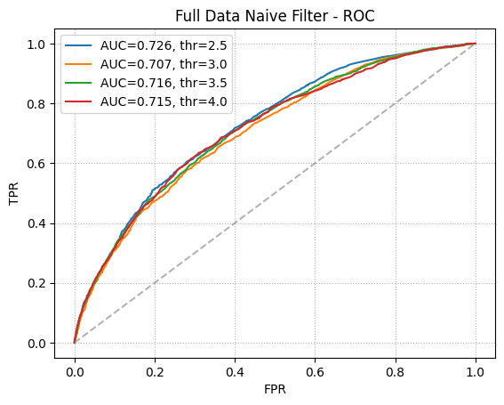
    


    Popular - 10-fold CV - Avg RMSE: 0.9308
    


    

    


    Unpopular - 10-fold CV - Avg RMSE: 0.8408
    


    

    


    High-Variance - 10-fold CV - Avg RMSE: 0.7973
    


    
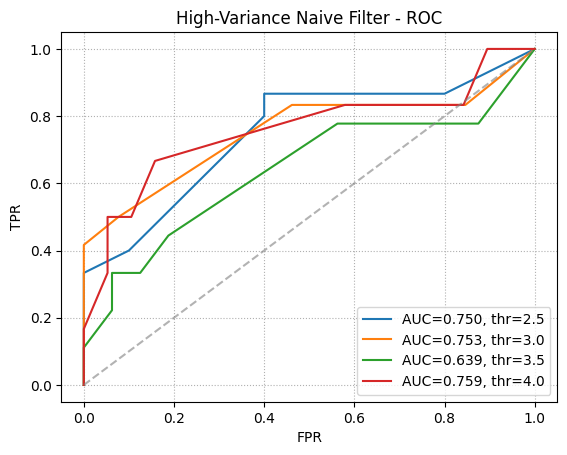
    


# Question 12


### From the firgure below (please note that these ROCs are plotted at the optimal k's for each CF), we can see that SVD CF performs best among all the CF, followed by k-NN CF and NNMF-CF coming last. We explain the performance as follows:

### **SVD vs NMF**:

### SVD is able to better represent the higher-dimensional feature matrix due to no constraints on U and V, providing a deep factorization with low information loss. NMF on the other hand, restricts U and V to be positive and has fewer optimal choices of elements in U and V compared to SVD.

### SVD produces a hierarchical and geometric basis ordered by relevance, producing embeddings with the most relevant features and traits in the ratings matrix higher in the hierarchy. Thus, embeddingsproduced by SVD are robust to outliers and noise in the ratings thanks to the ordering of the features. NMF, on the other hand, does not consider the geometry in the ratings matrix.

### The embeddings produced by SVD are unique and deterministic, whereas NMF is non-unique and stochastic, with no guarantees of convergence to the optimal U and V each time the function is called.

### SVD takes into account user and movie-specific bias information and normalizes them appropriately to reduce sensitivity to outliers and noise.

### **Why SVD edges k-NN**:

### k-NN is not modeling the bias information separately for each user or item. As a result, it is more sensitive to outliers and rarely rated items.

### k-NN performs inference directly on the sparse ratings matrix, which yields poor prediction accuracy in high-dimensional space (curse of dimensionality). This also hurts the scalability of the recommender system. High-dimensional inference requires large amounts of training data to work properly, which is absent as the ratings matrix is sparse.

### k-NN is much less generalizable compared to latent-factor based models, as it cannot find semantic information and connections within the user-item ratings matrix while being sensitive to rarely rated items.


```python
import matplotlib.pyplot as plt
from surprise import SVD, NMF, KNNWithMeans
from surprise import accuracy
from surprise.model_selection import train_test_split
from sklearn.metrics import roc_curve, auc

# Use Surprise's train_test_split, NOT sklearn's, on your Surprise dataset
trainset, testset = train_test_split(ratings_dataset, test_size=0.1, random_state=0)

# Fit each model on the Surprise 'trainset'
res_SVD  = SVD(n_factors=26, n_epochs=20, verbose=False).fit(trainset).test(testset)
res_NMF  = NMF(n_factors=18, n_epochs=50, verbose=False).fit(trainset).test(testset)
res_KNN  = KNNWithMeans(k=20, sim_options={'name':'pearson'}, verbose=False).fit(trainset).test(testset)

fig, ax = plt.subplots()

thresholded_out = []
for row in res_SVD:
    thresholded_out.append(1 if row.r_ui > 3 else 0)
fpr, tpr, _ = roc_curve(thresholded_out, [row.est for row in res_SVD])
ax.plot(fpr, tpr, lw=2, linestyle=':', label="AUC: "+str(auc(fpr,tpr))+", SVD")

thresholded_out = []
for row in res_NMF:
    thresholded_out.append(1 if row.r_ui > 3 else 0)
fpr, tpr, _ = roc_curve(thresholded_out, [row.est for row in res_NMF])
ax.plot(fpr, tpr, lw=2, linestyle=':', label="AUC: "+str(auc(fpr,tpr))+", NMF")

thresholded_out = []
for row in res_KNN:
    thresholded_out.append(1 if row.r_ui > 3 else 0)
fpr, tpr, _ = roc_curve(thresholded_out, [row.est for row in res_KNN])
ax.plot(fpr, tpr, lw=2, linestyle=':', label="AUC: "+str(auc(fpr,tpr))+", KNN")

ax.plot([0,1], [0,1], linestyle='--', lw=2, color='g', label='Chance', alpha=.5)
ax.legend(loc='best')
ax.grid(linestyle=':')
ax.set_title('ROC characteristics for SVD (MF), NMF and KNN')
ax.set_xlabel('FPR')
ax.set_ylabel('TPR')
plt.show()

```


    
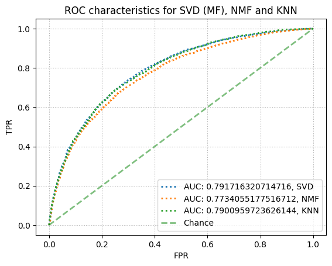
    

